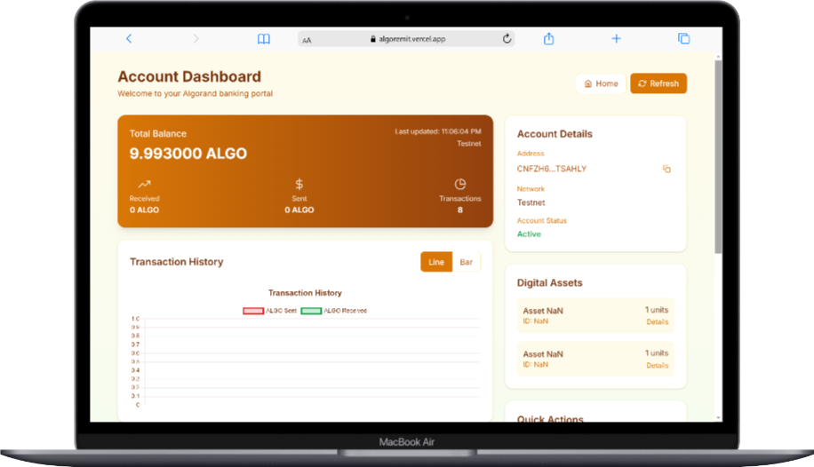
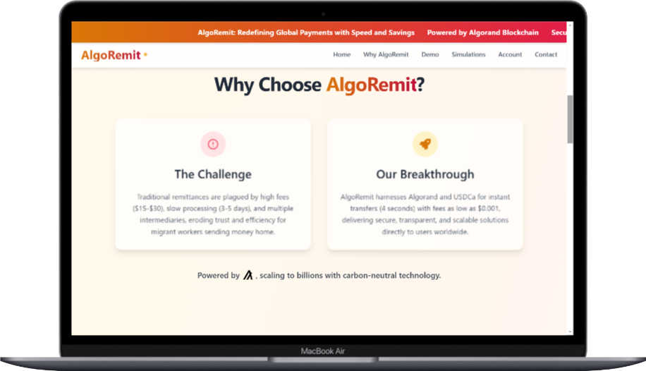
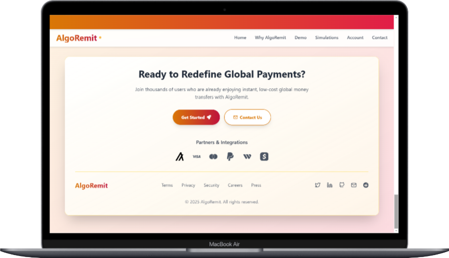

# AlgoRemit

AlgoRemit is a blockchain-powered remittance platform that leverages USDCa (USD Coin on Algorand) to enable low-cost, instant, and stable global money transfers. Built on the Algorand blockchain, AlgoRemit provides a secure and efficient solution for cross-border payments.


---

## Overview

AlgoRemit aims to revolutionize global money transfers by offering:
- **Low-Cost Transactions**: Minimal fees compared to traditional remittance services.
- **Instant Transfers**: Near-instantaneous transaction settlement using Algorand's high-speed blockchain.
- **Stable Value**: Utilizes USDCa, a stablecoin pegged to the US dollar, to ensure consistent value.
- **Secure and Transparent**: Built on Algorand’s secure and transparent blockchain technology.



---

## Getting Started

To explore or contribute to AlgoRemit, follow these steps to set up the project locally or in a GitHub Codespace.

### Prerequisites
- **Node.js**: Ensure Node.js is installed (version 14.x or later recommended).
- **AlgoKit**: Install AlgoKit to interact with the Algorand blockchain. Follow the [AlgoKit installation guide](https://github.com/algorandfoundation/algokit-cli).
- **Git**: Required for cloning and managing the repository.
- A modern web browser with JavaScript enabled to interact with the AlgoRemit web app.

### Fork the Repository
1. Navigate to the [AlgoRemit GitHub Repository](https://github.com/AbdulAHAD968/AlgoRemit).
2. Click the **Fork** button in the top-right corner to create a copy of the repository under your GitHub account.
3. Wait for the forking process to complete, then proceed to cloning or using Codespaces.

### Option 1: Using GitHub Codespaces (Recommended)
1. **Create a Codespace**:
   - On your forked repository, click the green **Code** button.
   - Select **Create codespace on main**.
   - Wait for the Codespace to initialize.
2. **Initialize the Project**:
   - Once the Codespace is loaded, run the following command in the terminal:
     ```bash
     algokit init
     ```
3. Follow the prompts to set up your Algorand project environment.

### Option 2: Local Setup
1. **Clone the Repository**:
   ```bash
   git clone https://github.com/YOUR_GITHUB_USERNAME/AlgoRemit.git
   cd AlgoRemit
   ```
2. **Install Dependencies**:
   ```bash
   npm install
   ```
3. **Initialize AlgoKit**:
   ```bash
   algokit init
   ```
4. Follow the prompts to configure your Algorand project.

### Running the Web App
1. Start the development server:
   ```bash
   npm start
   ```
2. Open your browser and navigate to `http://localhost:3000` to view the AlgoRemit web app.
   - **Note**: Ensure JavaScript is enabled in your browser.

---

## Reference Guide
For detailed setup instructions, prompts, and AI tips, refer to the [Web3 Masterclasses Reference Guide](https://github.com/AbdulAHAD968/AlgoRemit) included in the repository.

---

## Live Demo
Check out the live version of AlgoRemit at [https://algoremit.vercel.app/](https://algoremit.vercel.app/). Ensure JavaScript is enabled in your browser to use the app.



---

## Contributing
We welcome contributions to improve AlgoRemit! To contribute:
1. Fork the repository.
2. Create a new branch (`git checkout -b feature/your-feature`).
3. Make your changes and commit (`git commit -m "Add your feature"`).
4. Push to your branch (`git push origin feature/your-feature`).
5. Open a Pull Request on the main repository.

---

## License
This project is licensed under the MIT License. See the [LICENSE](LICENSE) file for details.

---

## Contact
For questions or support, reach out via GitHub Issues or contact the maintainer at [AbdulAHAD968](https://github.com/AbdulAHAD968).



## Footer
© 2025 AlgoRemit. Powered by Algorand and USDCa.
